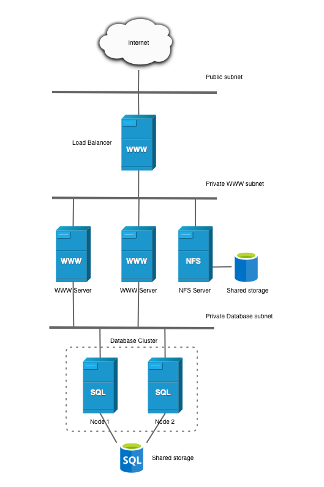
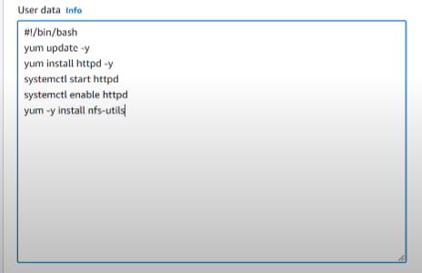
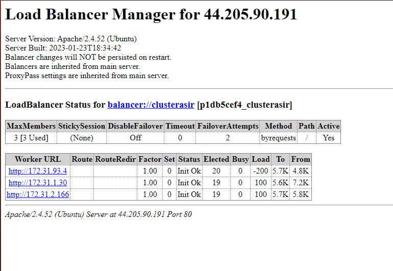
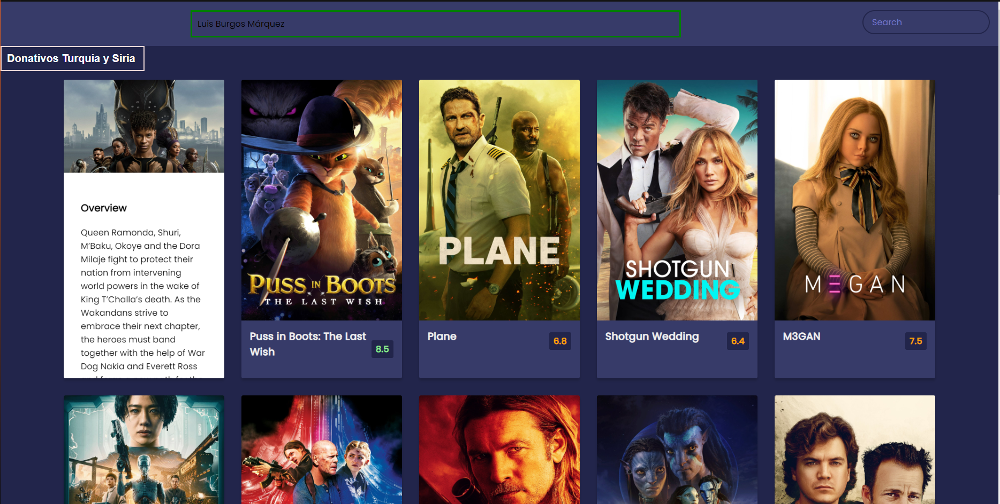
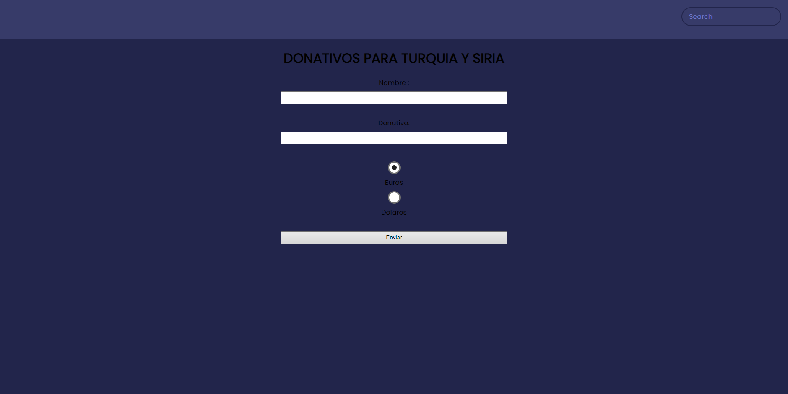
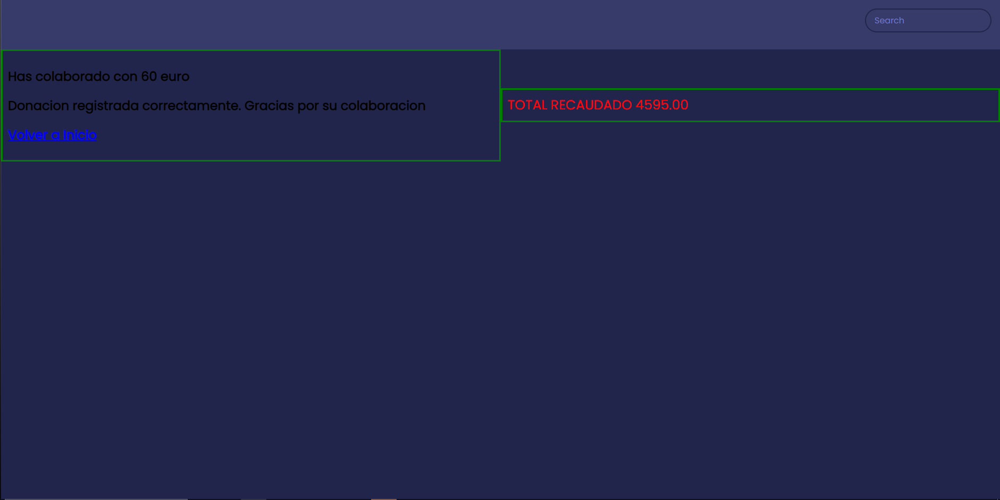

# Despliegue arquitectura EFS-EC2-MultiAZ (Luis Burgos Márquez)
En este documento técnico, se describirá el proceso de despliegue de una arquitectura EFS-EC2-MultiAZ en AWS. Esta arquitectura consta de varios componentes principales, incluyendo Amazon Elastic File System (EFS), Amazon Elastic Compute Cloud (EC2) y Multi-AZ, que se despliegan en una infraestructura de nube pública en AWS.

Arquitectura:

La arquitectura de EFS-EC2-MultiAZ en AWS está diseñada para proporcionar un almacenamiento compartido altamente disponible y escalable para instancias EC2 en múltiples zonas de disponibilidad (AZ) de AWS. La siguiente imagen ilustra la arquitectura básica:  



## Creación EFS+EC2

1- Crearemos el grupo de seguridad de las máquinas ec2, en estas tendremos que abrir los puertos para http y ssh para todo el mundo (posteriormente se explicara cómo securizar el despliegue). Posteriormente crearemos el grupo de seguridad para el sistema efs, en este abriremos el puerto para nfs pero solo para el grupo de seguridad antes creado

2- A continuación procedemos a lanzar las instancias ec2, lanzaremos dos 3 instancias con la siguiente configuración: como sistema operativo usaremos amazon linux, par de claves vokey, asignaremos una subred para cada máquina por ejemplo la a y la b, seleccionamos el grupo de seguridad antes creado y por último pondremos lo siguiente en user data:


3- Ahora crearemos el sistema EFS para ello le pondremos un nombre y usaremos la VPC por defecto y la "storage class" standard. Una vez se haya creado nuestro sistema EFS cambiaremos los grupos de que vendrán asignados por defecto por el que creamos en el primer paso y ya terminamos con este apartado

4- Una vez ya tenemos todo creado debemos conectarnos a las máquinas y configurarlas, para ello primero comprobaremos que el servicio http este funcionando correctamente, tras esto crearemos el directorio efs-mount en /var/www/html y montaremos el sistema efs sobre esa carpeta usando  
sudo mount -t nfs -o nfsvers=4.1,rsize=1048576,wsize=1048576,hard,timeo=600,retrans=2,noresvport tuefs.efs.us-east-1.amazonaws.com:/ efs-mount  
Tras esto nos descargaremos los ficheros de nuestra página web y repetiremos los pasos anteriores menos este último en las otras máquinas, esto ya que al haber montado ya el sistema efs cada máquina que montemos con este se sincronizará y obtendrá los ficheros o cambios que se hayan realizado.   

5- Una vez hecho esto modificaremos el documennt root de httpd a la carpeta que acabamos de montar para ello abrimos el archivo "/etc/httpd/conf/httpd.conf" y modificamos la línea DocumentRoot quedando asi:  
- DocumentRoot "/var/www/html/efs-mount" 
 
Tras esto nos iremos al archivo "/etc/fstab" y añadimos la siguiente línea para que no se nos desmonte el directorio al reiniciar las máquinas:  

- tuEFS.efs.us-east-1.amazonaws.com:/  /var/www/html/efs-mount nfs defaults 0 0
## Creación Balanceador de carga
Para la creación del balanceador de carga seguiremos los siguientes pasos:  
1- Crearemos una máquina EC2 nueva, esta no tendrá ninguna configuración adicional en la creación simplemente deberemos abrir el puerto 80 desde cualquier lugar y el puerto 22 temporalmente hasta que terminemos la configuración  

2- Una vez creada nuestra máquina nos conectaremos a ella y ya en esta usaremos los siguientes comandos:
- sudo apt update
- sudo apt install apache2
- sudo a2enmod proxy
- sudo a2enmod proxy_http
- sudo a2enmod proxy_ajp
- sudo a2enmod rewrite
- sudo a2enmod deflate
- sudo a2enmod headers
- sudo a2enmod proxy_balancer
- sudo a2enmod proxy_connect
- sudo a2enmod proxy_html
- sudo a2enmod lbmethod_byrequests

3- Una vez instalado todo tendremos que modificar el archivo "/etc/apache2/sites-enabled/000-default.conf"
en este añadiremos lo siguiente antes de la línea "</VirtualHost&gt;"
```
        ProxyPass /balancer-manager !

        <Proxy balancer://clusterasir>
        # Server 1
                BalancerMember http://ipserverweb1

        # Server 2
                BalancerMember http://ipserverweb2

        # Server 3
                BalancerMember http://ipserverweb3

         </Proxy>

    ProxyPass / balancer://clusterasir/
    ProxyPassReverse / balancer://clusterasir/

    <Location /balancer-manager>
       SetHandler balancer-manager
       Order Deny,Allow
       Allow from all
    </Location>
```
4- Hecho todo esto solo faltaria reiniciar apache y nuestro balanceador estaría terminado para comprobarlo recargamos varias veces nuestra página web y luego añadiremos al final de la url /balancer-manager y podremos ver cuantas peticiones se han hecho a cada server web 


## Creación de un cluster multi A-Z 

Comenzaremos creando una base de datos con la siguiente configuración:
- Creación estándar
- Motor MySQL
- Plantillas: Producción
- Versión del motor: MySQL 8.0.28
- Disponibilidad y durabilidad: Instancia de base de datos Multi-AZ (Esto crea una instancia de base de datos principal y una instancia de base de datos en espera en una zona de - disponibilidad diferente. Proporciona alta disponibilidad y redundancia de datos, pero la instancia de base de datos en espera no admite conexiones para cargas de trabajo de lectura)
- Identificador de instancias de bases de datos: Cluster
- Contraseña y usuario
- Configuración de la instancia: Clases con ráfagas (incluye clases t)
- Almacenamiento asignado: 100GiB
- Umbral de almacenamiento máximo: 200GiB
- Acceso público: si

Una vez creada la base de datos añadiremos una regla de entrada por el puerto 3306 que solo esté abierto para conexiones que lleguen desde los servidores web pero esto lo haremos más tarde ya que primeramente la dejaremos accesible desde todo el mundo para el siguiente paso.

Con la base de datos creada y configurada abriremos sesión desde cualquier gestor en nuestro caso heidiSQL y crearemos la base de datos necesaria para nuestra web la cual será para gestionar las donaciones:
```SQL
CREATE DATABASE Cluster;
USE Cluster;
CREATE TABLE donativos ( 
id INT(5) PRIMARY KEY AUTO_INCREMENT, 
nombre VARCHAR(30), 
donativo DECIMAL(8,2),
tipomoneda CHAR(5) CHECK (tipomoneda IN ('Euro','Dolar')));
```

Una vez creada la base de datos nos iremos de nuevo a una de nuestras máquinas con el servidor web, en nuestra página añadiremos un botón que nos redirija a un formulario y con los siguientes archivos php (debemos de haber instalado php previamente si no esto ficheros no funcionaran en nuestras máquinas) configuraremos la conexión con la base de datos:

- formulario.php
```php
<html>
<head>
 <meta charset="UTF-8" />
    <meta name="viewport" content="width=device-width, initial-scale=1.0" />
    <link rel="stylesheet" href="style.css" />
</head>
<body>
<header>
      <form id="form">
        <input type="text" id="search" class="search" placeholder="Search">
      </form>
</header>
<main id="main">
<form action="grabar.php" method="post" class="form">

     <label ><h1> DONATIVOS PARA TURQUIA Y SIRIA </h1></label>
    <label for="name">Nombre :</label>
    <input type="text" id="nombre" name="nombre">
    <br>
<label for="donativo">Donativo: </label>
    <input type="donativo" id="donativo" name="donativo">
    <br>
<input type="radio" name="tipomoneda" value="euro" checked > Euros <br>

    <input type="radio" name="tipomoneda" value="dolar"> Dolares <br>
    <br>
<input type="submit" value ="Enviar" name="enviar" />
</form>
</body>
</html>
```

- conexion.php
```php
<?php
$servername = "tuenpoint";
$username = "admin";
$password = "Root1234$";
$bd="cluster";
try {
    $conn = new PDO("mysql:host=$servername;dbname=$bd", $username, $password);
   } catch (PDOException $pe) {
    die("Could not connect to the database $dbname :" . $pe->getMessage());
}
?>
```
- grabar.php
```php
<html>
<head>
 <meta charset="UTF-8" />
    <meta name="viewport" content="width=device-width, initial-scale=1.0" />
    <link rel="stylesheet" href="style.css" />
</head>
<body>
  <header>
      <form id="form">
        <input type="text" id="search" class="search" placeholder="Search">
      </form>
    </header>
<main id="main">
<?php
include ('conexion.php');
$nombre=$_REQUEST['nombre'];
$donativo=$_REQUEST['donativo'];
$tipomoneda=$_REQUEST['tipomoneda'];
$data = [
    'nombre' => $nombre,
    'donativo' => $donativo,
    'tipomoneda' => $tipomoneda,
];
$sql = "INSERT INTO donativos VALUES (null,:nombre, :donativo, :tipomoneda)";
$stmt= $conn->prepare($sql);
$stmt->execute($data);
echo "<div class='center'>";
echo "<h2> Has colaborado con ". $donativo. "  " . $tipomoneda."</h2>" ;
echo "<h2> Donacion registrada correctamente. Gracias por su colaboracion </h2>";
echo "<h2><a href='index.html' > Volver a Inicio </a></h2>";
echo "</div>";
echo "<div class='center' style='font-size:25px;color: #FF0000'>";
 $sql = 'SELECT sum(donativo) as total from donativos;';
    foreach ($conn->query($sql) as $row) {
        echo "TOTAL RECAUDADO ".$row['total'] . "\n";
    }
echo "</div>";
?>
</main>
</body>
</html>
```
- prueba.php
```php
<?php
    phpinfo();
?>
```

Una vez terminado tendremos que tener algo tal que así:  





Tras comprobar que todo funcione correctamente comenzaremos a securizar el despliegue para ello eliminaremos la regla de entrada de ssh de los grupos de seguridad, quitaremos el acceso público de nuestra base de datos, cambiaremos la regla de entrada del puerto 3306 para que solo esté abierto para conexiones que lleguen desde los servidores web y por último cambiaremos el grupo de seguridad de las maquinas web para que solo el balanceador pueda acceder a ellas una vez hecho esto habremos terminado con el despliegue y con todo esto tendremos las siguientes ventajas:

- Escalabilidad: La combinación de EC2 y EFS permite escalar horizontalmente el sistema agregando más máquinas EC2 sin necesidad de reconfigurar el almacenamiento.

- Alta disponibilidad: Al utilizar una arquitectura MultiAZ, se garantiza una alta disponibilidad, ya que las máquinas EC2 están distribuidas en diferentes zonas de disponibilidad, lo que reduce el riesgo de una interrupción en el sistema.

- Balanceo de carga: Al usar un balanceador de carga, se asegura una distribución equilibrada de la carga de trabajo entre las máquinas EC2, lo que mejora el rendimiento y la capacidad de respuesta del sistema.

- Flexibilidad en el almacenamiento: Al utilizar EFS como sistema de almacenamiento compartido, se puede acceder y modificar fácilmente los archivos desde cualquier máquina EC2 en el clúster.

- Reducción de costos: Al utilizar una arquitectura MultiAZ, se pueden aprovechar los recursos de manera más eficiente y se reduce la dependencia de una sola máquina, lo que puede resultar en una reducción de costos a largo plazo.
